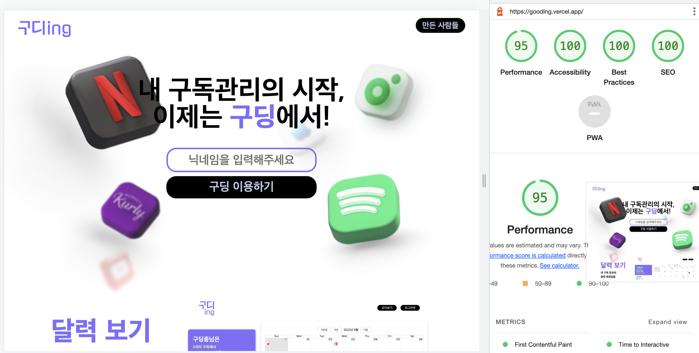
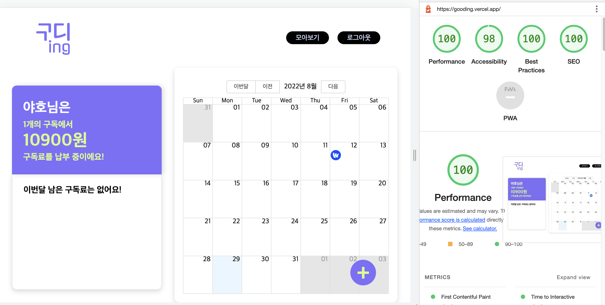

<h1>
📮 구딩 📮
</h1>

  

> 구딩과 함께 한 눈에 편리하게 구독을 관리해보세요!

 

## 목차

1. [**📕 배포 링크**](#1)
2. [**📗 조원 소개**](#2)
3. [**📘 프로젝트 소개**](#3)
4. [**📙 개발 소개용**](#4)

 

## 📕 배포 링크

[**🔗 구딩 링크**](https://gooding.vercel.app/)

 

## 📗 조원 소개

|Nickname|Profile|Github|
|:---:|:---:|:---:|
|EASY||<a href="https://github.com/thinkanddoit" target="_blank">@thinkanddoit</a>|
|레프||<a href="https://github.com/anottrx" target="_blank">@anottrx</a>|
|Hyun||<a href="https://github.com/qlemql" target="_blank">@qlemql</a>|
|찌나오||<a href="https://github.com/zzinao" target="_blank">@zzinao</a>|
|준||<a href="https://github.com/Junseongparkme" target="_blank">@Junseongparkme</a>|
|Ayaan||<a href="https://github.com/LEEHYUNHO2001" target="_blank">@LEEHYUNHO2001</a>|
|나동||<a href="https://github.com/Najeong-Kim" target="_blank">@Najeong-Kim</a>|

 

## 📘 프로젝트 소개

### 메인 페이지

### 구독 추가 모달

### 내 구독 보기

 

## 📙 개발 소개

### 프로젝트 과정

[피그잼](https://www.figma.com/file/TkcVY7Nj8J1mNupusqx24h/%ED%85%8C%EC%98%A4%EC%9D%98-%EC%8A%A4%ED%94%84%EB%A6%B0%ED%8A%B8-11%EA%B8%B0---3%EC%A1%B0-%3C%EA%B5%AC%EB%94%A9%3E?node-id=0%3A1)      
[피그마](https://www.figma.com/file/R70yYITQdYefeDgaZzL8tI/%EA%B5%AC%EB%94%A9?node-id=0%3A1)

### 기술스택

  
   

### lighthouse 성능 측정 결과

|                                                                로그인 화면                                                                 |
| :--------------------------------------------------------------------------------------------------------------------------------------: |
|  |

|                                  캘린더 화면                                  |
| :---------------------------------------------------------------------------: |
|  |

 
 
